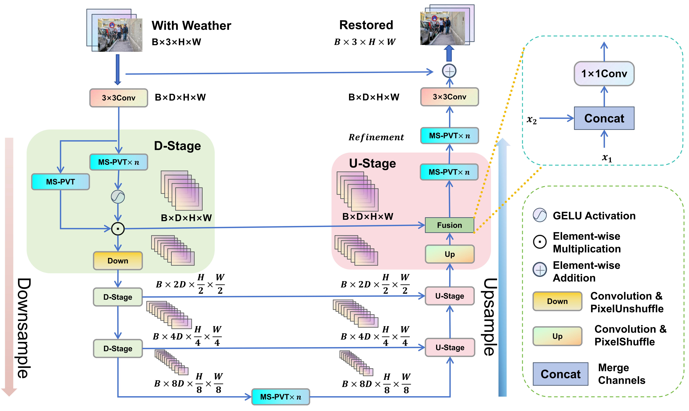
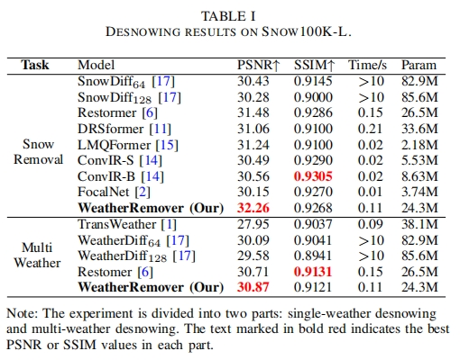
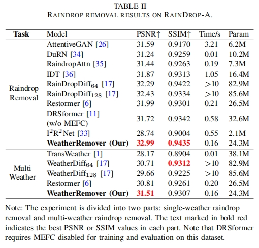
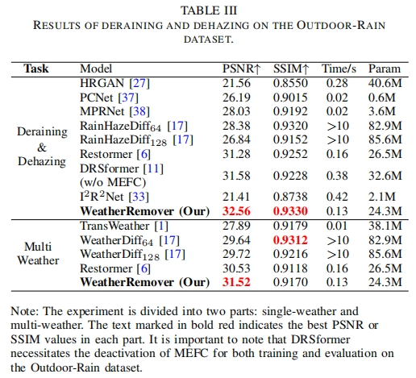
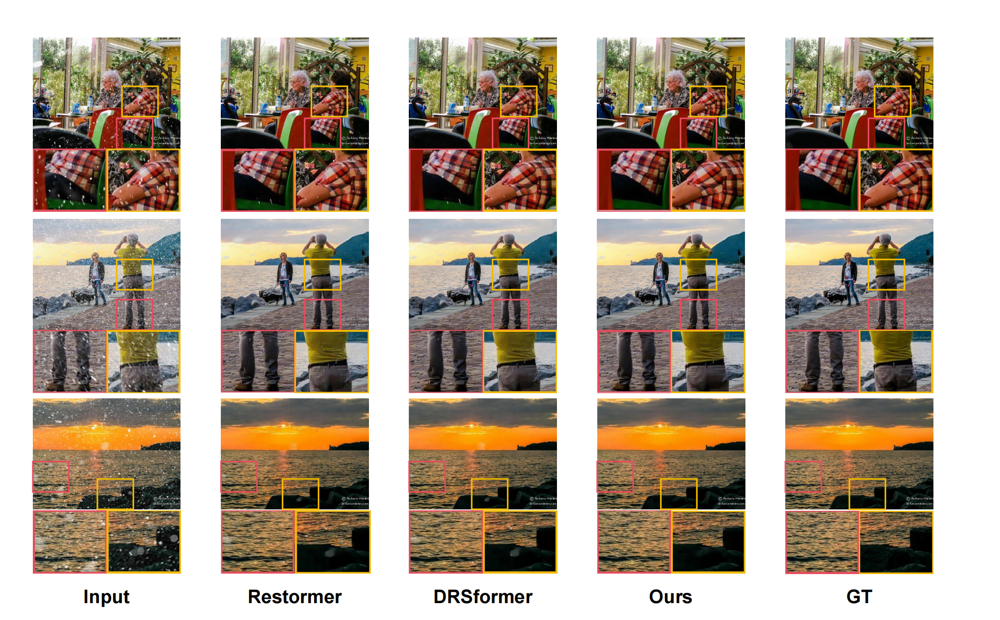
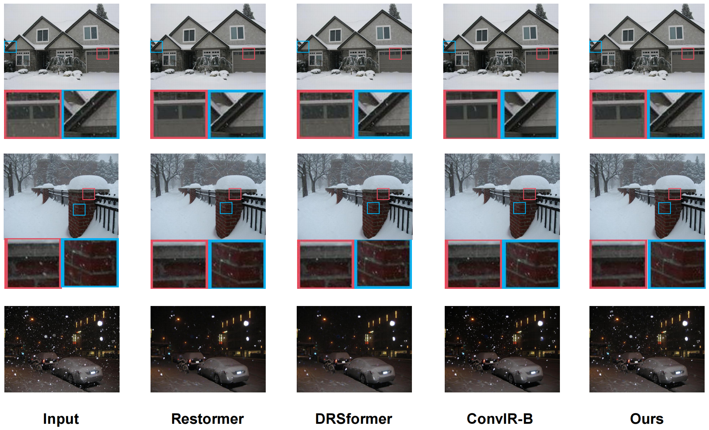
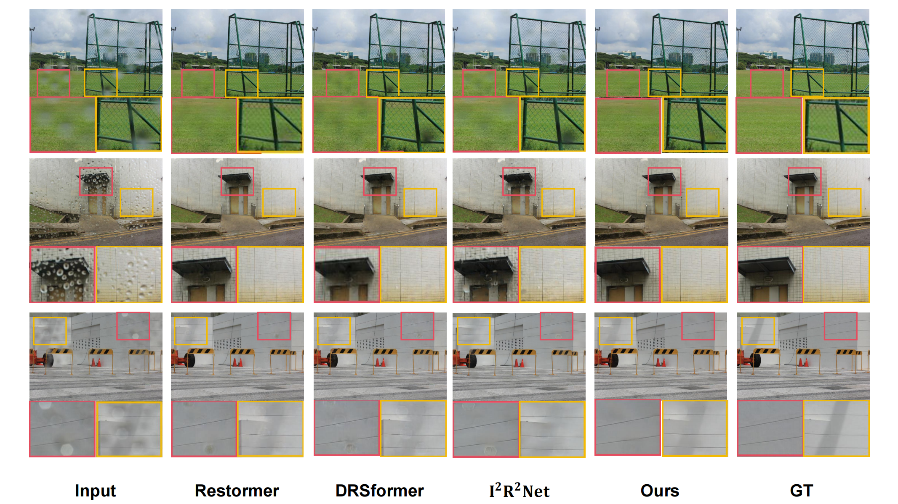
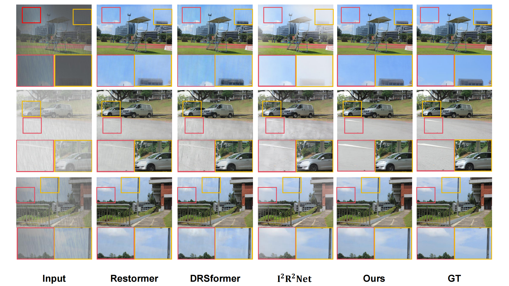
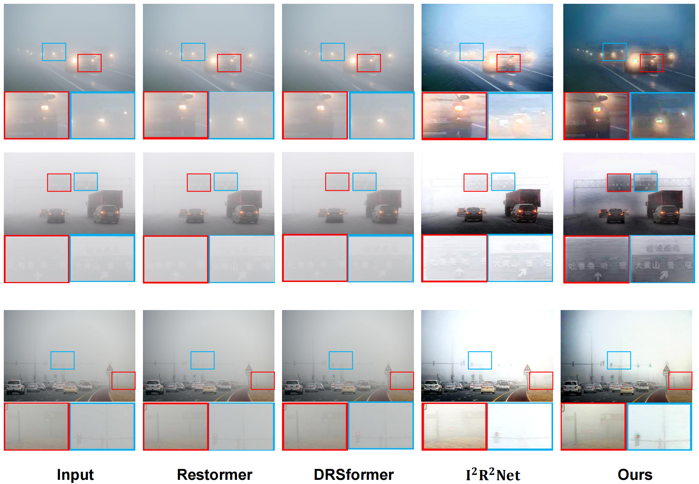

# WeatherRemover

This is the source code for WeatherRemover (WeatherRemover: All-in-one Adverse Weather Removal with Multi-scale Feature Map Compression). Accepted by **IEEE Transactions on Artificial Intelligence**.

Paper link: [WeatherRemover (Early Access)](https://ieeexplore.ieee.org/document/11247943)

## Architecture



## Requirement

The project is built with Python 3.11.5,CUDA 11.8.Using the following command to install dependency packages

```
pip install -r requirements.txt
```

Specifically, our project requires the following libraries:

```
einops==0.8.0
matplotlib==3.9.1
numpy==2.0.1
opencv_python_headless==4.8.1.78
Pillow==10.4.0
timm==1.0.8
torch==2.0.0
torchvision==0.15.1
```

## Checkpoints

Checkpoints are available on [Google Drive]([https://drive.google.com/file/d/1y8-QKdJOEKyhfkwVZ7YdQBJD4LXMg97q/view?usp=drive_link](https://drive.google.com/file/d/1y8-QKdJOEKyhfkwVZ7YdQBJD4LXMg97q/view?usp=sharing)).

We also offer the link of [Baidu Netdisk](https://pan.baidu.com/s/1p_O4WWGI4xyj4xA-WaSGeg?pwd=xf1g), password:xf1g

## Dataset Structure

Download the datasets and arrange them in the following format.

```
Your_dataset
|── train
|	|── input
|	|── gt
|	|── train.txt
|
|── test
|	|── input
|	|── gt
|	|── test.txt
```

The file `train.txt` contains the relative paths of each image in the training set within the `input` directory, such as `input/1.png`. The file `test.txt` contains the relative paths of each image in the test set within the `input` directory. Note that the filenames in the `input` directory must be the same as the filenames in the `gt` directory.

## Document Introduction

`model/cmformer.py`is where our model is located. `test/measure.py`is used for evaluation. `utils/train_data_functions.py`and `utils/val_data_functions.py`related to dataset processing.  `test`directory is used to evaluate the model.

## Train

All experiments were completed on a single **NVIDIA RTX 3090**.

`train_step.py` is used to train our model with the following parameter description:

`-exp_name`: Specify the path for saving checkpoints.

`-save_step`: Specify the interval for saving checkpoints.

`-crop_size`: Specify the image size to be used during training.

`-checkpoint`: Specify the path of the checkpoint used for training recovery.

`-learning_rate`: Specify the learning rate.

`-num_steps`: Specify the number of training iterations.

`-train_batch_size`: Batch size for training.

`-train_data_dir`: Training set directory.

`-val_data_dir`: Test set directory

**Demo** for how to perform the training:

```
python train_step.py -train_data_dir ./data/raindrop/train -val_data_dir ./data/raindrop/test_a -learning_rate 0.0003 -num_steps 80000 -train_batch_size 8 -crop_size 128 128 -save_step 2000 -exp_name ./checkpoint/raindrop
```

**Note :**

During the training process, the training is divided into several stages, each using different learning rates, image sizes, and batch sizes. Therefore, we will execute different commands in stages to complete the training. 

We encapsulated these training commands into the script `run.py`. If you just want to train with the default training configuration, run `python run.py` and follow the prompts to enter the training set directory, the test set directory and the checkpoint save location to automatically perform the training

## Test

The "test" directory holds scripts related to evaluation. `test.py` is used to perform inference on test sets with ground truth and automate evaluation. `test_no_gt.py`for inference on the real test set (no ground truth). `measure.py`is used for manual evaluation of SSIM, PSNR.

**Demo** of using `test.py` or `test_no_gt.py`

```
python test.py -save_place ./raindrop -checkpoint ./checkpoint/raindrop_ckpt -val_data_dir ./data/raindrop/test_a
```

**Usage** of using `measure.py`: 

Modify `gt_path` and `results_path` in the code (the ground truth directory and the directory where the repaired image is located), then run `python measure.py`.

## Comparison Test Results

<details>
<summary><strong>Snow100K</strong> (click to expand) </summary>
    
</details>

<details>
<summary><strong>RainDrop</strong> (click to expand) </summary>
    
</details>

<details>
<summary><strong>Outdoor-Rain</strong> (click to expand) </summary>
    
</details>


## Visual Images

<details>
<summary><strong>Image Desnowing(Snow100K)</strong> (click to expand) </summary>
    
</details>

<details>
<summary><strong>Image Desnowing(Real Snow)</strong> (click to expand) </summary>
    
</details>

<details>
<summary><strong>Raindrop Removal</strong> (click to expand) </summary>
    
</details>

<details>
<summary><strong>Deraining & Dehazing(Outdoor-Rain)</strong> (click to expand) </summary>
    
</details>

<details>
<summary><strong>Deraining & Dehazing(Real)</strong> (click to expand) </summary>
    
</details>


